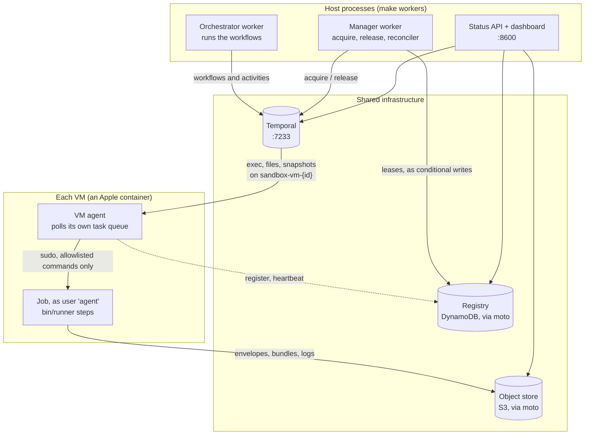
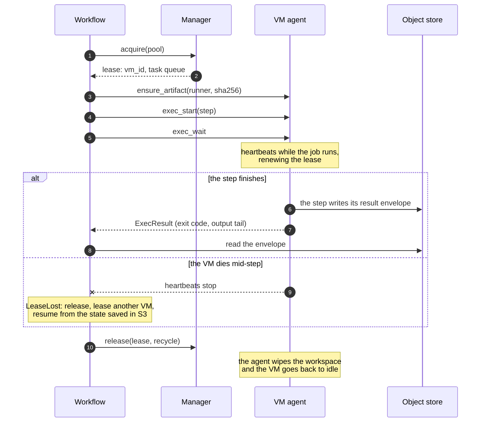
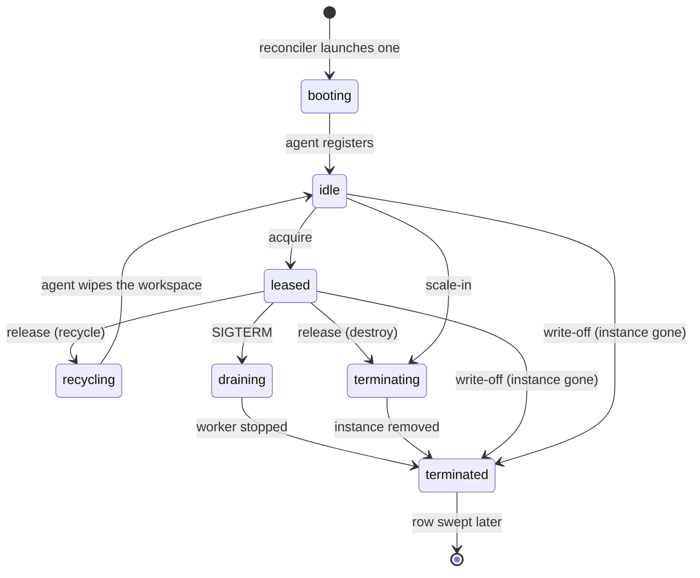

# Temporal Sandbox Control Plane


-lightgrey.svg)

An educational, fully local demo of splitting a coding agent's workflow from
the VM it runs on. A [Temporal](https://temporal.io) workflow leases a VM
through a small versioned contract, drives it through a coding session, and
hands it back — the workflow itself never runs on the machine it's directing.
Everything runs on one laptop: a Temporal dev server, [moto](https://github.com/getmoto/moto)
standing in for DynamoDB and S3, Apple `container` VMs, and a live dashboard.

## What it demonstrates

- **Leases outlive workers.** Kill the orchestrator mid-turn — the in-flight
  step is retried and reattaches to the job record still on the VM's disk. No
  rerun.
- **A dead VM is a retry, not a failure.** Kill the VM under a running
  session and it finishes on a second one, picking up from the last saved
  turn.
- **The fleet heals itself.** A reconciler tops the pool up from nothing,
  writes off dead VMs, releases orphaned leases, and scales out under demand
  and back in after a cooldown — all through conditional writes on one
  DynamoDB row, so two managers can never win the same lease.
- **Everything is watchable.** A dashboard joins the registry, the VM
  provider, Temporal, and S3 into one page with a live event feed. Every
  command's log shows what it found (the failing test, the built program's
  output), each VM opens to its timeline and console, and a storage browser
  shows what is in S3 and DynamoDB. The Temporal UI shows every activity on
  its queue.
- **A real build, snapshotted and restored elsewhere.** Clone a Go repository
  from GitHub, edit it, compile and run it in one VM, snapshot the result, and
  run the restored binary on a second VM without rebuilding.
- **Jobs are fenced in.** A job may only run commands on an allowlist, only
  through a narrowed sudo rule, and only reach the network hosts its policy
  names (github.com, for the demo) — each checked against a real VM by
  `make check-sudoers` and `make check-network`.

## How it works

### The idea: the workflow is not on the machine

A coding agent needs a machine to run commands on, but a machine can crash,
be preempted, or run out of disk mid-task. If the agent's *workflow* — its
plan, its progress, which turn it's on — lived on that machine, it would die
with it. So they're split:

- **The workflow** runs in [Temporal](https://temporal.io), which records every
  step it takes. If the process running it dies, another one replays that
  record and carries on from the same point.
- **The VM** is a disposable worker. The workflow *leases* one, tells it what
  to run through a small, versioned set of operations (the *contract*), and
  hands it back. It never trusts the VM to remember anything that matters:
  results come back through the object store, and a session's state is saved
  there after every turn.

Losing a VM therefore costs, at most, the step it was running — never the
session.

### The pieces



Three task queues carry all the traffic: `orchestrator-queue` for the
workflows, `sandbox-manager-queue` for leasing, and one queue per VM, named
after it, that only that VM's agent listens on. The only bytes that cross
between the workflow and a VM are object-store URIs — never file contents or
logs inside a Temporal payload.

### One job, start to finish



A step's *outcome* — tests failing, a non-zero exit — is data the workflow
reads and reacts to. Only *infrastructure* failure (a VM that stops answering)
is an error, and the answer to that is always the same: lease another VM.

### A VM's life



Every arrow is a *conditional write* on the VM's one row in the registry, so
two managers racing for the same idle VM can't both win it. A **reconciler**
runs every 15 seconds and does the housekeeping no single workflow owns:
launching VMs up to the pool's floor, writing off VMs whose instance is gone,
releasing leases whose workflow has died, and retiring surplus VMs.

### Where to go from here

The [numbered course](#documentation) builds these ideas up one chapter at a
time. [`docs/sandbox-control-plane.html`](docs/sandbox-control-plane.html) is a
standalone page with the same diagrams in more detail — open it in a browser.

## Requirements

- **macOS on Apple Silicon.** The VMs are Apple [`container`](https://github.com/apple/container)
  VMs, which is what requires the silicon and a recent macOS.
- Three command-line tools, all from Homebrew:

  ```sh
  brew install container temporal uv
  ```

  `uv` fetches Python 3.12 itself if you don't have it. `make bootstrap`
  checks for `container` and `temporal` and says what to install if either is
  missing.
- About 2 GB of disk for the VM image, and network access for the first
  `make image` (it pulls Ubuntu) and for `make demo-gobuild` (it clones from GitHub).

### macOS firewall

The VMs reach two services on your Mac: Temporal and the moto stand-in for
DynamoDB and S3. If the macOS firewall is on, it silently drops those
connections, and `make up` stops with
`a VM could not reach the host moto server`. Allow the two programs through it
once:

```sh
PY="$(uv run python -c 'import os, sys; print(os.path.realpath(sys.executable))')"
TEMPORAL="$(realpath "$(command -v temporal)")"
for bin in "$PY" "$TEMPORAL"; do
  sudo /usr/libexec/ApplicationFirewall/socketfilterfw --add "$bin" --unblockapp "$bin"
done
```

Then `make down && make up`.

## Quick start

```sh
git clone https://github.com/wangzhihao0629/temporal-sandbox-control-plane.git
cd temporal-sandbox-control-plane
make bootstrap   # uv sync; checks for the temporal and container CLIs
make up          # container system, Temporal dev server, moto, .env
make image       # builds the sandbox-vm:dev image (a few minutes the first time)
make artifact    # packages and uploads the turn runner
make workers     # starts the manager, orchestrator, and status API — and keeps running
```

`make workers` stays in the foreground and streams the workers' logs, so leave
it running and use a **second terminal** for the rest:

```sh
make demo-session  # waits for two VMs to boot, runs a smoke check, then one coding session
```

The first run takes a minute or two while the reconciler boots the pool's
first two VMs. Open **http://localhost:8600** for the dashboard and
**http://localhost:8233** for the Temporal UI while it runs.

Tear down by stopping `make workers` with Ctrl-C, then `make down`.

## Try it further

Beyond the one-shot demo, there are targeted drills for each failure mode:

```sh
make session SCENARIO=multiply-with-bug   # a session with a fix loop
make chaos-kill VM=<vm-id>                # kill a leased VM mid-turn
make chaos-stop VM=<vm-id>                # drain a leased VM (SIGTERM)
make hold SECONDS=120                     # hold a lease, then orphan it
make demo-gobuild                         # clone, edit, build, run, snapshot, restore
make show                                 # raw registry/fleet snapshot
make check-sudoers                        # what the VM's sudo rule allows and refuses
make check-network                        # what a job may connect to
```

[Chapter 08](docs/08-running-the-demo.md) walks through all twelve demo
steps — cold start, smoke, session, orchestrator/manager restarts, VM death,
orphaned leases, capacity, drain, giving up, and scale-in — with the exact
command, what to watch for, and the code path behind each one.

## Documentation

A numbered course, each chapter building on the last:

- [00 · Why split the VM from the workflow](docs/00-why-split.md)
- [01 · The architecture in one picture](docs/01-architecture.md)
- [02 · The contract: what a workflow may ask a VM](docs/02-the-contract.md)
- [03 · Leases, the registry, and the reconciler](docs/03-lease-lifecycle.md)
- [04 · Inside a VM: the agent that runs jobs](docs/04-vm-agent.md)
- [05 · The provider: where VMs come from](docs/05-provider.md)
- [06 · A coding session: the orchestrator and the fake agent](docs/06-orchestrator-and-fake-agent.md)
- [07 · Watching it: the status API and dashboard](docs/07-dashboard.md)
- [08 · Running the demo](docs/08-running-the-demo.md)
- [09 · From demo to production](docs/09-from-demo-to-production.md)
- [10 · Snapshots, egress, and a real build](docs/10-snapshots-egress-and-a-real-build.md)

## Testing

```sh
make test   # uv run pytest -q
make lint   # ruff
```

These run against the pure/unit and moto-backed integration suites — no VM
or Temporal server required.

## Code map

Every component is one package under `sandbox/`, about 5,900 lines of code in
all (not counting comments and docstrings). Nearly every module opens with a short
*What / Why / Production* docstring saying what it does, why it is shaped that
way, and what would change in production.

| Package | What it is | Lines | Start reading at |
|---|---|---:|---|
| `sandbox/contract/` | The versioned wire contract: types, activity names, errors, the exec and network policies | 240 | `sandbox/contract/types.py` |
| `sandbox/client/` | What a workflow calls: `Sandbox.lease`, `Lease.exec`, `with_lease_retries` | 310 | `sandbox/client/sandbox.py` |
| `sandbox/registry/` | The DynamoDB tables: VM rows, leases, jobs, events | 580 | `claim_idle` in `sandbox/registry/client.py` |
| `sandbox/manager/` | Acquire and release, pool policy, chaos | 210 | `sandbox/manager/activities.py` |
| `sandbox/manager/reconciler/` | The loop that keeps each pool sized and healthy | 480 | `sandbox/manager/reconciler/core.py` |
| `sandbox/manager/providers/` | Where VMs come from: Apple `container`, and an in-process fake | 180 | `sandbox/manager/providers/base.py` |
| `sandbox/vm_agent/` | What runs inside a VM: jobs, heartbeat, drain, snapshots, egress rules | 1,160 | `sandbox/vm_agent/activities.py` |
| `sandbox/orchestrator/` | The demo workflows | 590 | `sandbox/orchestrator/workflows.py` |
| `sandbox/runner/` | The program a job runs on the VM, including the fake coding agent | 1,000 | `sandbox/runner/cli.py` |
| `sandbox/status/` | The read API and dashboard | 530 | `sandbox/status/api.py` |
| `sandbox/cli/` | One module per make target (`make smoke` runs `sandbox.cli.smoke`) | 360 | `sandbox/cli/common.py` |
| `sandbox/testing/` | An in-process VM for tests | 75 | `sandbox/testing/inprocess_vm.py` |

Outside `sandbox/`: `images/vm/` is the VM image (Dockerfile, entrypoint,
sudoers rule, seed repository), `scripts/` brings the stack up and down and
probes the image, `tests/` holds the unit and integration suites, and `docs/`
holds the course.

Two pieces of code carry most of the idea. A workflow uses a VM like this —
lease one, run commands through the contract, and the lease is released
however the block exits (`SmokeWorkflow`, in `sandbox/orchestrator/workflows.py`):

```python
async with sandbox.lease(spec) as vm:
    info = await vm.describe()
    uname = await vm.exec(
        ExecSpec(job_id=vm.new_job_id(), argv=["uname", "-a"], cwd=vm.workspace(), timeout_seconds=30)
    )
```

And one condition is what makes a lease exclusive: `claim_idle` in
`sandbox/registry/client.py` flips a VM from idle to leased only if it is still
idle and unleased at the moment of the write, so two managers racing for the
same VM cannot both win it:

```python
ConditionExpression="#s = :idle AND attribute_not_exists(lease_id)",
```

## License

[MIT](LICENSE)
